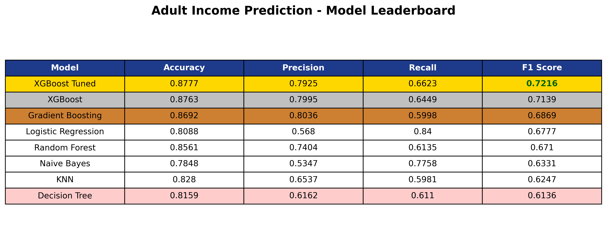
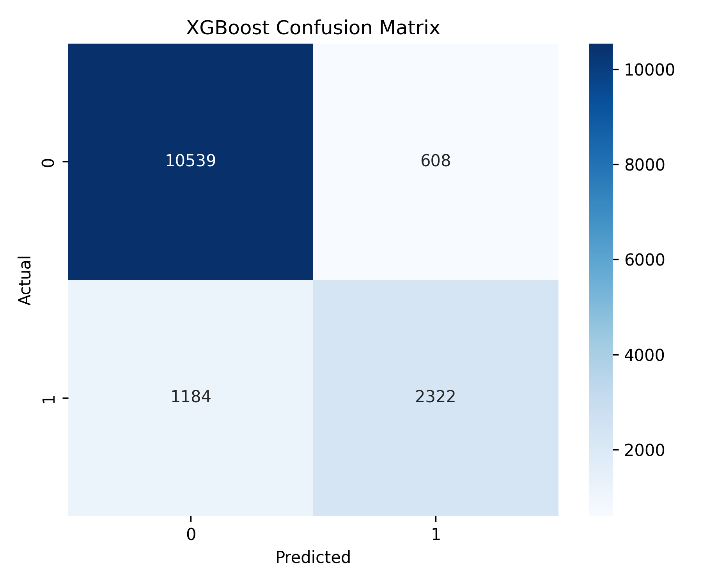

# 💰 Adult Income Prediction using Machine Learning

Predict whether an individual's annual income exceeds **$50K** using demographic and employment-related features from the Adult Census Income Dataset.

---

## 🚀 Project Highlights

✅ End-to-End Machine Learning Pipeline

✅ Data Cleaning & Missing Value Handling

✅ Feature Engineering with One-Hot Encoding

✅ Multiple ML Models Compared

✅ Hyperparameter-Tuned XGBoost

✅ Model Persistence using Joblib

✅ Visual Evaluation Reports

---

## 📊 Dataset Overview

| Metric         | Value                                 |
| -------------- | ------------------------------------- |
| Rows           | 48,842                                |
| Features       | 14                                    |
| Missing Values | workclass, occupation, native-country |
| Target         | income                                |
| Classes        | <=50K, >50K                           |

### Target Distribution

| Class | Percentage |
| ----- | ---------- |
| <=50K | 76.07%     |
| >50K  | 23.93%     |

Observation: The dataset is moderately imbalanced.

---

## 🧹 Data Preprocessing

| Step             | Description                                      |
| ---------------- | ------------------------------------------------ |
| Missing Values   | '?' replaced with NaN                            |
| Imputation       | Filled categorical missing values with "Unknown" |
| Encoding         | One-Hot Encoding                                 |
| Scaling          | StandardScaler for numerical features            |
| Train/Test Split | 70/30                                            |
| Label Encoding   | Applied to target variable                       |

---

## 🔍 Interesting Findings from EDA

### Missing Values

| Feature        | Missing % |
| -------------- | --------- |
| occupation     | 5.75%     |
| workclass      | 5.73%     |
| native-country | 1.75%     |

### Numerical Insights

| Feature        | Observation                               |
| -------------- | ----------------------------------------- |
| age            | Right-skewed distribution                 |
| fnlwgt         | Heavy right-skew with large outliers      |
| capital-gain   | Extremely sparse with huge outliers       |
| capital-loss   | Extremely sparse with huge outliers       |
| hours-per-week | Strong concentration around 40 hours/week |

### Correlation with Income

| Feature         | Correlation |
| --------------- | ----------- |
| educational-num | 0.33        |
| age             | 0.23        |
| hours-per-week  | 0.23        |
| capital-gain    | 0.22        |
| capital-loss    | 0.15        |
| fnlwgt          | ~0.00       |

Observation: Education level showed the strongest linear relationship with income.

---

## 🏆 Final Results



The leaderboard makes the result clear at a glance: **Tuned XGBoost** came out on top.

### Performance Summary

| Rank | Model               | Accuracy | Precision | Recall | F1 Score |
| ---- | ------------------- | -------- | --------- | ------ | -------- |
| 🥇   | XGBoost Tuned       | 87.77%   | 79.25%    | 66.23% | 72.16%   |
| 🥈   | XGBoost             | 87.63%   | 79.95%    | 64.49% | 71.39%   |
| 🥉   | Gradient Boosting   | 86.92%   | 80.36%    | 59.98% | 68.69%   |
| 4    | Logistic Regression | 80.88%   | 56.80%    | 84.00% | 67.77%   |
| 5    | SVM                 | 86.18%   | 77.77%    | 59.16% | 67.20%   |
| 6    | Random Forest       | 85.61%   | 74.04%    | 61.35% | 67.10%   |

### XGBoost Confusion Matrix




---

## 🏅 Best Model

**Tuned XGBoost**

Why?

* Highest F1 Score
* Highest overall accuracy
* Strong balance between precision and recall
* Outperformed all baseline models

---

## 🛠 Tech Stack

* Python
* Pandas
* NumPy
* Scikit-Learn
* XGBoost
* Matplotlib
* Seaborn
* Joblib

---

## 📂 Project Structure


```text
Adult-income/
│
├── data/
├── models/
├── notebooks/
├── reports/
├── src/
├── main.py
├── requirements.txt
└── README.md
```
## Project Structure


---

## 🎯 Key Learning Outcomes

* Handling real-world missing data
* Building reusable preprocessing pipelines
* Comparing multiple ML algorithms
* Hyperparameter tuning with GridSearchCV
* Evaluating models using Precision, Recall, F1 Score and Confusion Matrix
* Interpreting feature importance in tree-based models

---

## 👨‍💻 Author

Manan Verma

Machine Learning | Software Development | AI Engineering
